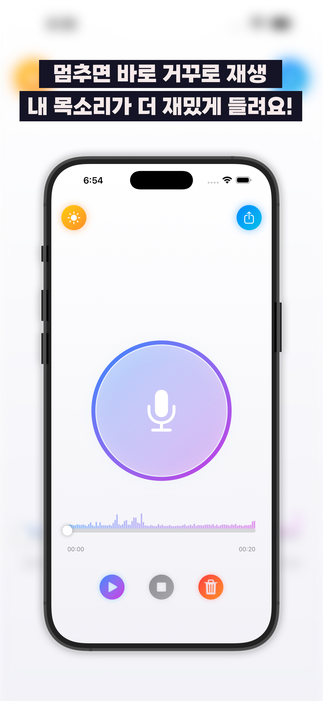
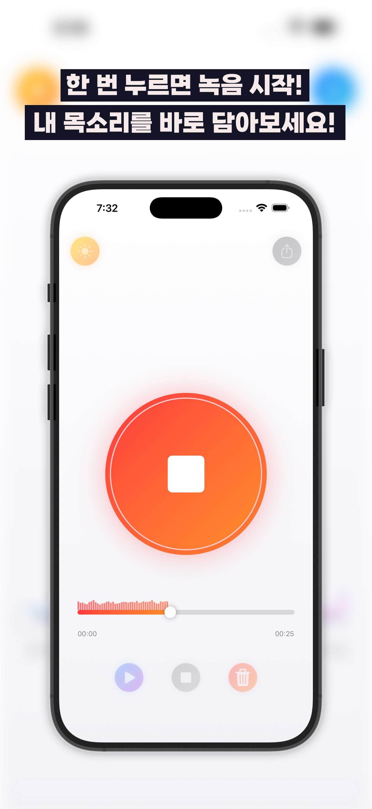
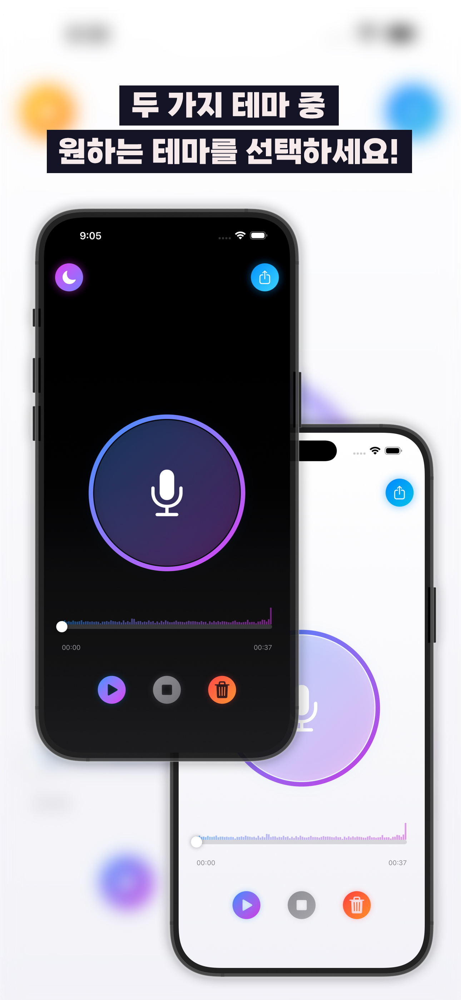

# ReverseRecorder

목소리를 녹음하면 **거꾸로 재생해주는** iOS 앱입니다.
녹음을 멈추는 순간 자동으로 역재생 변환이 시작되고, 파형과 함께 재생됩니다.

- 플랫폼: iOS 18.6+ (SwiftUI)
- 최대 녹음 길이: 60초
- 오디오 처리는 AVFoundation만 사용 — 외부 오디오 라이브러리 없음
- 사용 지표 수집용으로 Firebase Analytics만 붙어 있습니다

<p>
  
  
  
</p>

왼쪽부터 녹음 대기, 녹음 중 실시간 파형, 라이트/다크 테마.

## 기술적으로 다룬 것

**1. PCM 버퍼를 직접 뒤집는 역재생 변환**
AVFoundation에는 "오디오를 뒤집는" API가 없습니다.
파일을 `AVAudioPCMBuffer`로 통째로 읽어 **채널별 float 샘플 배열을 직접 뒤집고**
새 파일로 다시 씁니다.

```swift
let audioFile = try AVAudioFile(forReading: sourceURL)
let buffer = AVAudioPCMBuffer(pcmFormat: format, frameCapacity: frameCount)
try audioFile.read(into: buffer)

guard let floatChannelData = buffer.floatChannelData else { ... }
// 채널마다 샘플을 뒤집는다
samples.reverse()

let outputFile = try AVAudioFile(forWriting: outputURL, settings: format.settings)
try outputFile.write(from: buffer)
```

스테레오는 채널별로 따로 뒤집어야 좌우가 섞이지 않습니다.
→ [`Services/AudioReverseService.swift`](ReverseRecorder/Services/AudioReverseService.swift)

**2. 변환 진행률 표시**
짧은 녹음은 순식간이지만 60초짜리는 체감됩니다.
`reverseAudioWithProgress`로 변환 진행률을 콜백해
`ProcessingWaveformView`가 파형 애니메이션과 함께 진행 상태를 보여줍니다.

**3. 실시간 녹음 파형**
`AudioWaveformService`가 녹음 중 오디오 레벨을 샘플링해
펄스 효과가 있는 파형으로 그립니다. 재생 시에는 드래그로 위치를 옮길 수 있는
프로그레스 바에 같은 파형을 재사용합니다.

**4. 원형 트랜지션 다크모드 토글**
`ThemeSnapshotService`가 전환 직전 화면을 스냅샷으로 떠서,
원이 퍼지는 애니메이션으로 라이트/다크 모드를 교체합니다.

## 구조

```
ReverseRecorder/
├── Services/    녹음 · 재생 · 역재생 변환 · 파형 · 파일 관리 · 테마 스냅샷
├── ViewModels/  RecorderViewModel (녹음→변환→재생 상태 기계)
├── Views/       녹음 버튼 · 파형 · 재생 컨트롤 · 프로그레스 · 공유 · 토스트
└── Models/      AudioRecording
```

기능을 서비스 단위로 쪼개고 ViewModel이 조합하는 구조라,
녹음·변환·재생 각각을 따로 테스트하고 교체할 수 있습니다.

## 기술 스택

SwiftUI · AVFoundation(AVAudioFile, AVAudioPCMBuffer, AVAudioRecorder, AVAudioPlayer)
Firebase Analytics (SPM, `firebase-ios-sdk`) — `ReverseRecorderApp.swift`의 `AppDelegate`에서 `FirebaseApp.configure()`만 호출합니다.

`ReverseRecorder/GoogleService-Info.plist`는 저장소에 포함되어 있습니다.
이 파일은 앱을 Firebase 프로젝트에 연결하는 **클라이언트 식별자**일 뿐 비밀값이 아니며,
실제 접근 통제는 서버 쪽 Firebase 보안 규칙이 담당합니다.

## 실행 방법

```bash
git clone https://github.com/JuseongMoon/ReverseRecorder.git
cd ReverseRecorder
open ReverseRecorder.xcodeproj
```

마이크 권한이 필요합니다. 시뮬레이터에서도 동작하지만 실제 기기에서 파형이 더 자연스럽습니다.

## 라이선스

MIT License. 자세한 내용은 [LICENSE](LICENSE)를 참고하세요.
